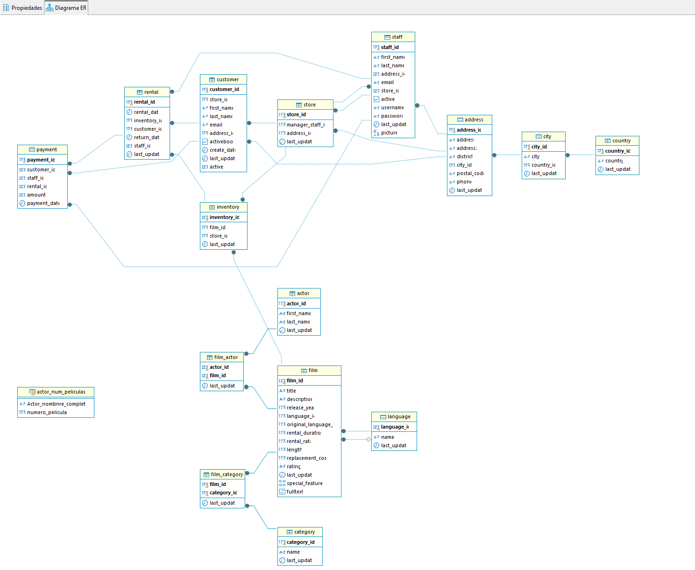

# Proyecto CineStore_consultas SQL


<div style="text-align: left;">
  
</div>

Este proyecto tiene como objetivo elaborar consultas SQL utilizando la base de datos de una tienda de películas ficticia. El objetivo es demostrar dominio de herramientas, métodos y buenas prácticas en el análisis de datos.


## Objetivos del proyecto

Las consultas SQL elaboradas en el proyecto demuestran los siguientes conocimientos:

● Manejo de la herramienta DBeaver.

● Manejo de las consultas con una sola tabla de la BBDD.

● Manejo de las relaciones entre tablas.

● Manejo de las subconsultas.

● Vistas.

● Estructura de datos temporales.

● Buenas prácticas.

## Herramientas del proyecto

● PostgreSQL.

● DBeaver.

● Visual Studio Code.

## Estructura del proyecto

```bash
Proyecto_CineStore_Consultas-_SQL/
│
├──README.md
│
├──Datos_primarios/  #Carpeta con el archivo con la base de datos.
│     └──BBDD_Proyecto.sql
│
├──Codigo_consultas/ #Carpeta con archivo con las consultas finales.
│     └──Proyecto_Cinestore_SQL_code.sql
│
└──Img
    ├──CineStore_logo.png
    └──Diagrama_ER.png 
```

## Desarrollo del proyecto

### Importación de datos y creación de BBDD

Tras descargar el archivo SQL “BBDD_Proyecto” correspondiente a una base de datos de una tienda de películas ficticia, accedo a la aplicación de Dbeaver donde instalo esta base de datos. Accediendo al navegador de Base de Datos > dentro de “Postgres” > “Bases de datos” >“Crear Nueva Base de Datos”, configuro el nombre y el dueño. 

Una vez creada, ingreso la información en la base de datos, ya que por el momento está vacía.  Para ello, establezco por defecto la base de datos y a continuación, a través de “Archivo” >“Archivo denominado”, busco en el ordenador la “BBDD_Proyecto” que descargué originalmente y la abro. 
Una vez abierta, selecciono todo el código y lo ejecuto. 

### Creación del diagrama ER

Tras haber ejecutado el código vuelvo al navegador de Bases de Datos y refresco el sistema.
 De esta manera ya tengo instalada la base da Datos pudiendo comenzar con la creación de del Diagrama ER. Accedo a través del navegador de Bases de Datos a CineStore > Esquemas> Public > Ver Esquema.

### Creación documento SQL para alojar el código:

Para realizar las consultas del proyecto creo un documento SQL a través del Visual Studio Code (Archivo > Nuevo archivo) y lo guardo. En este documento iré almacenando las distintas consultas a medida que las vaya resolviendo en Dbeaver, incluyendo los distintos enunciados y notas como comentarios.


### Creacion repositorio y exportación de documentos:

Una vez terminadas todas las conlsultas, creo un nuevo repositorio en GitHub donde subo el documento SQL con el código de las consultas, un archivo README.md (donde se indican los pasos llevados a cabo) y dos archivos PNG (con el Diagrama ER y la portada del repositorio).

### Elaboración del código:

En la elaboracion del código se ha tenido en cuenta:

- Usar siempre los comandos  SELECT, FROM, WHERE,… en mayúsculas.  
-	Finalizar las consultas con (;)
-	Order de ejecucion de los comandos versus orden de escritura.
-	Enumerar por separado las columnas, usando comas en el SELECT.
-	Comentarios de linea o multilinea usando los comandos necesarios (--) o  (/**).
-	Uso de WHERE para devolver filas que cumplan una condición.
-	Uso de operadores numericos =, < , > ,.. y de texto IN, NOT IN.
-	 Uso de Alias AS y CONCAT, usando comillas en los renombres de las columnas.
-	Consultas de Agregacion (MIN, MAX, COUNT, SUM,AVG,..).
-	Consultas de ordenación (ORDER BY, WHERE, LIMIT, OFFSET) y agrupación (GROUP BY  y  HAVING).
-	Relaciones entre tablas, (INNER JOIN, LEFT JOIN, CROSS JOIN).
-	Subconsultas con WHERE, creacion de vistas y tablas temporales.


## Esquema ER

<div style="text-align: center;">
   


<div style="text-align: left;">


## Contribuciones

Si tienes alguna propuesta o corrección, no dudes en compartirla. Cualquier tipo de colaboración, ya sea en forma de código, documentación o comentarios, será apreciada y considerada. ¡Gracias por tu participación!


## Autor

<div style="text-align: left;">

- Victor - [GitHub Profile](https://github.com/Vic-tor123)


